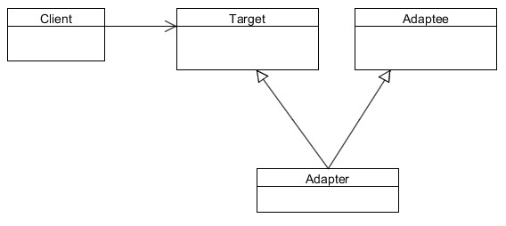

# Adapter Design Pattern

## 2.1 Adapter Pattern
A software developer, Max, has worked on an e-commerce website. The website allows users to shop and pay online. The site
is integrated with a 3rd party payment gateway, through which users can pay their bills using their credit card. Everything was
going well, until his manager called him for a change in the project.

**The manager told him that they are planning to change the payment gateway vendor, and he has to implement that in the
code.**
  
The problem that arises here is that the site is attached to the Xpay payment gateway which takes an Xpay type of object. The
new vendor, PayD, only allows the PayD type of objects to allow the process. Max doesn’t want to change the whole set of 100
of classes which have reference to an object of type XPay. This also raises the risk on the project, which is already running on the
production. Neither he can change the 3rd party tool of the payment gateway. The problem has occurred due to the incompatible
interfaces between the two different parts of the code. In order to get the process work, Max needs to find a way to make the
code compatible with the vendor’s provided API.

Current Code with the Xpay’s API
    

Now, the current code interface is not compatible with the new vendor’s interface.

## 2.2 An Adapter to rescue
What Max needs here is an Adapter which can sit in between the code and the vendor’s API, and can allow the process to flow.
But before the solution, let us first see what an adapter is, and how it works.

Sometimes, there could be a scenario when two objects don’t fit together, as they should in-order to get the work done. This
situation could arise when we are trying to integrate a legacy code with a new code, or when changing a 3rd party API in the
code. This is due to incompatible interfaces of the two objects which do not fit together.

The Adapter pattern lets you to adapt what an object or a class exposes to what another object or class expects. It converts
the interface of a class into another interface the client expects. It lets classes work together that couldn’t otherwise because of
incompatible interfaces. It allows to fix the interface between the objects and the classes without modifying the objects and the
classes directly.

You can think of an Adapter as a real world adapter which is used to connect two different pieces of equipment that cannot be
connected directly. An adapter sits in-between these equipments, it gets the flow from the equipment and provides it to the other
equipment in the form it wants, which otherwise, is impossible to get due to their incompatible interfaces.

An adapter uses composition to store the object it is supposed to adapt, and when the adapter’s methods are called, it translates
those calls into something the adapted object can understand and passes the calls on to the adapted object. The code that calls the
adapter never needs to know that it’s not dealing with the kind of object it thinks it is, but an adapted object instead.

Now, lets us see how it’s going to solve the Max’s problem.

## 2.3 Solution to the problem
Currently, the code is exposed to the Xpay interface. The interface looks something like this:
~~~java
package com.zanxus.javacodegeeks.patterns.adapterpattern.xpay;

/**
 * @author zanxus
 * @create 2016-11-22-下午4:54
 */
public interface Xpay {
    public String getCreditCardNo();

    public String getCustomerName();

    public String getCardExpMonth();

    public String getCardExpYear();

    public Short getCardCVVNo();

    public Double getAmount();

    public void setCreditCardNo(String creditCardNo);

    public void setCustomerName(String customerName);

    public void setCardExpMonth(String cardExpMonth);

    public void setCardExpYear(String cardExpYear);

    public void setCardCVVNo(Short cardCVVNo);

    public void setAmount(Double amount);
}
~~~
It contains set of setters and getter method used to get the information about the credit card and customer name. This Xpay
interface is implemented in the code which is used to instantiate an object of this type, and exposes the object to the vendor’s
API.

The following class defines the implementation to the Xpay interface.
~~~java
package com.zanxus.javacodegeeks.patterns.adapterpattern.site;

import com.zanxus.javacodegeeks.patterns.adapterpattern.xpay.Xpay;

/**
 * @author zanxus
 * @description XpayImpl
 * @create 2016-11-22-下午5:06
 */
public class XpayImpl implements Xpay {

    private String creditCardNo;

    private String customerName;

    private String cardExpMonth;

    private String cardExpYear;

    private short cardCVVNo;

    private Double amount;

    @Override
    public String getCreditCardNo() {
        return creditCardNo;
    }

    @Override
    public void setCreditCardNo(String creditCardNo) {
        this.creditCardNo = creditCardNo;
    }

    @Override
    public String getCustomerName() {
        return customerName;
    }

    @Override
    public void setCustomerName(String customerName) {
        this.customerName = customerName;
    }

    @Override
    public String getCardExpMonth() {
        return cardExpMonth;
    }

    @Override
    public void setCardExpMonth(String cardExpMonth) {
        this.cardExpMonth = cardExpMonth;
    }

    @Override
    public String getCardExpYear() {
        return cardExpYear;
    }

    @Override
    public void setCardExpYear(String cardExpYear) {
        this.cardExpYear = cardExpYear;
    }

    @Override
    public Short getCardCVVNo() {
        return cardCVVNo;
    }

    @Override
    public void setCardCVVNo(Short cardCVVNo) {
        this.cardCVVNo = cardCVVNo;
    }

    @Override
    public Double getAmount() {
        return amount;
    }

    @Override
    public void setAmount(Double amount) {
        this.amount = amount;
    }
}
~~~
New vendor’s key interface looks like this:
~~~java
package com.zanxus.javacodegeeks.patterns.adapterpattern.payd;

/**
 * @author zanxus
 * @create 2016-11-22-下午5:14
 */
public interface PayD {
    public String getCustCardNo();

    public void setCustCardNo(String custCardNo);

    public String getCardOwnerName();

    public void setCardOwnerName(String cardOwnerName);

    public String getCardExpMonthDate();

    public void setCardExpMonthDate(String cardExpMonthDate);

    public Integer getCVVNo();

    public void setCVVNo(Integer cVVNo);

    public Double getTotalAmount();

    public void setTotalAmount(Double totalAmount);

}
~~~

As you can see, this interface has a set of different methods which need to be implemented in the code. But Xpay is created by
most part of the code, it’s really hard and risky to change the entire set of classes.

We need some way, that’s able to fulfill the vendor’s requirement in order to process the payment and also make less or no change
in the current code. The way is provided by the Adapter pattern.

We will create an adapter which will be of type PayD, and it wraps an Xpay object (the type it supposes to be adapted).
~~~java
package com.zanxus.javacodegeeks.patterns.adapterpattern.site;

import com.zanxus.javacodegeeks.patterns.adapterpattern.payd.PayD;
import com.zanxus.javacodegeeks.patterns.adapterpattern.xpay.Xpay;

/**
 * @author zanxus
 * @description
 * @create 2016-11-22-下午5:19
 */
public class XpayToPayDAdapter implements PayD {
    private String custCardNo;

    private String cardOwnerName;

    private String cardExpMonthDate;

    private Integer cVVNo;

    private Double totalAmount;

    private final Xpay xpay;

    public XpayToPayDAdapter(Xpay xpay) {
        this.xpay = xpay;
        setProp();
    }

    private void setProp() {
        setCardOwnerName(this.xpay.getCustomerName());
        setCustCardNo(this.xpay.getCreditCardNo());
        setCardExpMonthDate(this.xpay.getCardExpMonth()+"/"+this.xpay.getCardExpYear());
        setCVVNo(this.xpay.getCardCVVNo().intValue());
        setTotalAmount(this.xpay.getAmount());
    }

    @Override
    public String getCustCardNo() {
        return custCardNo;
    }

    @Override
    public void setCustCardNo(String custCardNo) {
        this.custCardNo = custCardNo;
    }

    @Override
    public String getCardOwnerName() {
        return cardOwnerName;
    }

    @Override
    public void setCardOwnerName(String cardOwnerName) {
        this.cardOwnerName = cardOwnerName;
    }

    @Override
    public String getCardExpMonthDate() {
        return cardExpMonthDate;
    }

    @Override
    public void setCardExpMonthDate(String cardExpMonthDate) {
        this.cardExpMonthDate = cardExpMonthDate;
    }

    @Override
    public Integer getCVVNo() {
        return cVVNo;
    }

    @Override
    public void setCVVNo(Integer cVVNo) {
        this.cVVNo = cVVNo;
    }

    @Override
    public Double getTotalAmount() {
        return totalAmount;
    }

    @Override
    public void setTotalAmount(Double totalAmount) {
        this.totalAmount = totalAmount;
    }

}
~~~
In the above code, we have created an Adapter(XpayToPayDAdapter). The adapter implements the PayD interface, as it
is required to mimic like a PayD type of object. The adapter uses object composition to hold the object, it’s supposed to be
adapting, an Xpay type of object. The object is passed into the adapter through its constructor.

Now, please note that we have two incompatible types of interfaces, which we need to fit together using an adapter in order to
make the code work. These two interfaces have a different set of methods. But the sole purpose of these interfaces is very much
similar, i.e. to provide the customer and credit card info to their specific vendors.

The setProp() method of the above class is used to set the xpay’s properties into the payD’s object. We set the methods
which are similar in work in both the interfaces. However, there is only single method in PayD interface to set the month
and the year of the credit card, as opposed to two methods in the Xpay interface. We joined the result of the two methods
of the Xpay object (this.xpay.getCardExpMonth()+"/"+this.xpay.getCardExpYear()) and sets it into the
setCardExpMonthDate() method.

Let us test the above code and see whether it can solve the Max’s problem.
~~~java
package com.zanxus.javacodegeeks.patterns.adapterpattern.site;

import com.zanxus.javacodegeeks.patterns.adapterpattern.payd.PayD;
import com.zanxus.javacodegeeks.patterns.adapterpattern.xpay.Xpay;

/**
 * @author zanxus
 * @description
 * @create 2016-11-22-下午5:34
 */
public class RunAdapterExample {

    public static void main(String[] args) {
        Xpay xpay = new XpayImpl();
        xpay.setCreditCardNo("1234567898766543");
        xpay.setCustomerName("Max");
        xpay.setCardExpMonth("09");
        xpay.setCardExpYear("20");
        xpay.setCardCVVNo((short)111);
        xpay.setAmount(2345.11);

        PayD payD = new XpayToPayDAdapter(xpay);

        testPayD(payD);

    }

    private static void testPayD(PayD payD) {
        System.out.println(payD.getCardOwnerName());
        System.out.println(payD.getCustCardNo());
        System.out.println(payD.getCardExpMonthDate());
        System.out.println(payD.getCVVNo());
        System.out.println(payD.getTotalAmount());
    }
}
~~~
In the above class, first we have created an Xpay object and set its properties. Then, we created an adapter and pass it that
xpay object in its constructor, and assigned it to the PayD interface. The testPayD() static method takes a PayD type as an
argument which run and print its methods in order to test. As far as, the type passed into the testPayD() method is of type
PayD the method will execute the object without any problem. Above, we passed an adapter to it, which looks like a type of
PayD, but internally it wraps an Xpay type of object.

So, in the Max’s project all we need to implement the vendor’s API in the code and pass this adapter to the vendor’s method to
make the payment work. We do not need to change anything in the existing code.

## 2.4 Class Adapter
There are two types of adapters, the object adapter, and the class adapter. So far, we have seen the example of the object adapter
which use object’s composition, whereas, the class adapter relies on multiple inheritance to adapt one interface to another. As
Java does not support multiple inheritance, we cannot show you an example of multiple inheritance, but you can keep this in
mind and may implement it in one of your favorite Object Oriented Language like c++ which supports multiple inheritance.

To implement a class adapter, an adapter would inherit publicly from Target and privately from Adaptee. As the result, adapter
would be a subtype of Target, but not for Adaptee.

## 2.5 When to use Adapter Pattern
The Adapter pattern should be used when:
* There is an existing class, and its interface does not match the one you need.
* You want to create a reusable class that cooperates with unrelated or unforeseen classes, that is, classes that don’t necessarily
have compatible interfaces.
* There are several existing subclasses to be use, but it’s impractical to adapt their interface by subclassing every one. An object
adapter can adapt the interface of its parent class.